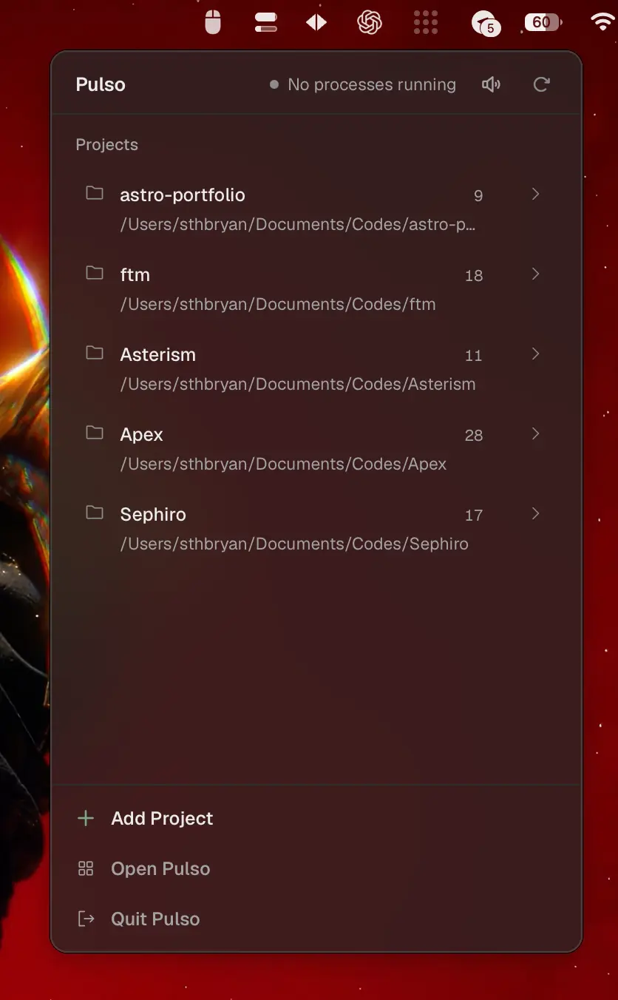
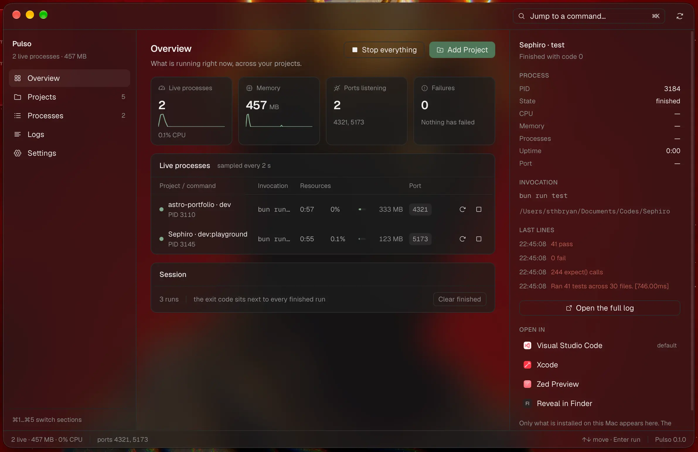

<h1 align="center">Pulso</h1>

<p align="center">
  
</p>

<p align="center">
  <strong>Project commands, from the menu bar.</strong>
</p>

<p align="center">
  Add a folder. Pulso finds the scripts.<br />
  Start, stop, and restart with a click.<br />
  See status, logs, and the port it opened.
</p>

<p align="center">
  
</p>

---

Pulso lives in the macOS menu bar, one click from a command. Everything else — every project, its processes, its logs, the record of what has run — lives in a small window. Close the popover and the process keeps running. Quit Pulso and it takes down what it started, unless you have told it to leave your processes alone.

No account. No cloud. No team. It only manages processes it launched.

---

## What it actually does

**Detects the commands you already have**  
Drop in a project folder. Pulso reads `package.json` first, then Make, Just, Task, Cargo, Compose, `composer.json`, `deno.json`, and `Procfile`. Every script it finds is a command you can run, with the file it came from written next to it.

**Play, stop, restart**  
One click starts a command. Stop signals the whole process group, not just the parent PID. Restart is stop then start. The popover shows running time and state.

**Logs without a terminal**  
stdout and stderr stream into a window. Search, copy, or save the whole thing to a file. Autoscroll pauses when you scroll up.

**Ports you can open**  
Pulso watches logs for URLs and confirms listening sockets on the process tree. Open the one that is actually yours.

**The count rides on the icon**  
The menu bar icon carries how many processes are alive, so a glance tells you the state without opening anything. Behind it sits every project and everything each one can run.

**The window holds the detail**  
Favorites, a command palette, live CPU and memory per process, and a timeline of everything that has run — including runs from before this launch.

<p align="center">
  
</p>

---

## Built for

- People who keep a stack of `npm run dev` tabs open
- Local servers you want to start from the bar and forget until you need the URL
- Folders with too many scripts to remember which one is the real entry

---

## Not this

Pulso is not a full terminal, a remote runner, or a cloud dashboard. It does not SSH, schedule jobs, or sync across machines. Windows and Linux come after macOS.

---

## Run it

A Mac, [Bun](https://bun.sh), and the Rust toolchain. Nothing to sign up for.

```bash
bun install
bun run desktop
```

Pulso is built for yourself, not for a store. It reads the folders you add, writes a small database of its own, and talks to nothing else.

---

<p align="center">
  <sub>Local. Personal. macOS first.</sub>
</p>
